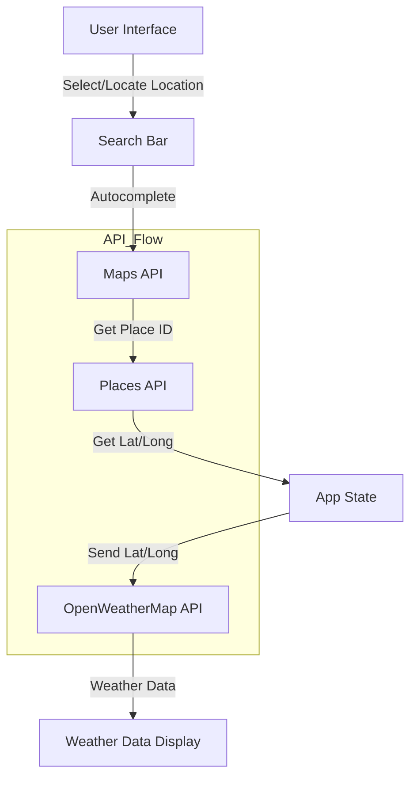

## Deployed at [https://weather-fccjr.vercel.app/](https://weather-fccjr.vercel.app/)

# Architecture Diagram



## API flow

1. The app gets the current location or a location is selected from the search box which is autocompleted by Maps API.
2. A location's placeID is then sent to Places API to get the lat and long.
3. The lat and long are then sent to OpenWeatherApp

## Getting Started

1. Install packages
2. Create .env.local file in root

```

NEXT_PUBLIC_OPEN_WEATHER_API_KEY=
NEXT_PUBLIC_GOOGLE_API_KEY=

```

3. un the development server:

```bash
npm run dev
# or
yarn dev
# or
pnpm dev
# or
bun dev
```

Open [http://localhost:3000](http://localhost:3000) with your browser to see the result.

## Deployment

This app is connected to Vercel and will build production everytime a push is made to master

